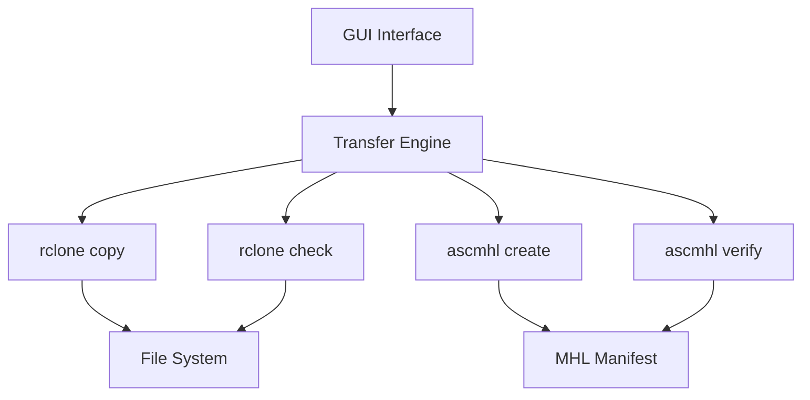

# DIT Pro v2.0 - Secure Media Transfer Tool

  

**Professional-grade media transfer application with checksum verification and ASC-MHL manifest generation.**

## ✨ Features

- **Secure File Transfers**: Uses `rclone` with checksum verification for bit-perfect copies
- **ASC-MHL Compliance**: Automatically generates and verifies ASC Media Hash List manifests
- **Dual Destination Support**: Transfer to primary and backup destinations simultaneously
- **Real-time Progress Monitoring**: Live transfer speed, ETA, and current file display
- **Pre-flight Checks**: Automatic disk space verification and source validation
- **Parallel Transfers**: Configurable parallel file transfers for optimal performance
- **Comprehensive Logging**: Detailed transfer logs with timestamps and error tracking
- **Modern GUI**: Clean, dark-themed interface built with CustomTkinter
- **Configuration Persistence**: Remembers your frequently used paths and settings

## 🚀 Quick Start

### Prerequisites

#### Python Packages:
```bash
pip install customtkinter
```

#### System Dependencies:
- **rclone** ([Download](https://rclone.org/downloads/))
- **ascmhl** ([Download](https://github.com/ascmitc/mhl))

#### Installation Commands:

**macOS:**
```bash
brew install rclone ascmhl
pip install customtkinter
```

**Ubuntu/Debian:**
```bash
sudo apt install rclone
sudo apt install python3-tk
pip install customtkinter
# Download ascmhl from GitHub releases
```

**Windows:**
1. Install Python 3.7+ from [python.org](https://python.org)
2. Install packages:
   ```cmd
   pip install customtkinter
   ```
3. Download `rclone.exe` and `ascmhl` and add to PATH

### Running the Application

```bash
git clone https://github.com/yourusername/dit-pro.git
cd dit-pro
python dit_offload.py
```

## 📋 Usage Guide

### Basic Workflow

1. **Select Source**: Click "Browse Source" to select your media folder
2. **Select Destinations**: Choose primary and optional backup destinations
3. **Configure Options**: Set parallel transfer count (default: 4)
4. **Start Transfer**: Click "START TRANSFER" to begin
5. **Monitor Progress**: Watch real-time progress in the right panel
6. **Verification**: Automatic checksum verification and MHL generation

### Transfer Process

The application follows this secure workflow:
```
Source Media → rclone copy (checksum) → Destination → rclone verify → ASC-MHL create → ASC-MHL verify → ✅ Complete
```

### Log Files

All transfers are logged to `./dit_logs/` with timestamps:
```
dit_logs/
├── transfer_20240115_143022.log
├── transfer_20240115_152145.log
└── transfer_20240116_093411.log
```

## 🛠️ Technical Details

### Architecture



### Key Components

1. **TransferEngine**: Core transfer logic with rclone integration
2. **DITLogger**: Comprehensive logging system
3. **ConfigManager**: JSON-based configuration persistence
4. **ProfessionalDITApp**: Modern GUI with real-time updates

### Verification Methods

- **Checksum Verification**: Uses rclone's built-in checksum comparison
- **ASC-MHL Compliance**: Industry-standard manifest format for archival
- **Disk Space Pre-check**: Prevents failed transfers due to insufficient space
- **File Count Validation**: Ensures source directory is not empty

## 🔧 Configuration

### Settings File (`dit_config.json`)
```json
{
  "src": "/Volumes/CameraCard/",
  "dst1": "/Volumes/BackupDrive/",
  "dst2": "/Volumes/SecondBackup/",
  "transfers": "4"
}
```

### Command Line Options
While primarily GUI-based, the tool can be extended with command-line arguments by modifying the source code.

## 📁 Project Structure

```
dit-pro/
├── dit_offload.py          # Main application
├── README.md               # This file
├── requirements.txt        # Python dependencies
├── dit_config.json        # Auto-generated user settings
├── dit_logs/              # Transfer logs directory
├── screenshots/           # Application screenshots
└── examples/              # Usage examples
```

## 🤝 Contributing

Contributions are welcome! Please follow these steps:

1. Fork the repository
2. Create a feature branch (`git checkout -b feature/AmazingFeature`)
3. Commit your changes (`git commit -m 'Add AmazingFeature'`)
4. Push to the branch (`git push origin feature/AmazingFeature`)
5. Open a Pull Request

### Development Setup
```bash
# Clone and install dev dependencies
git clone https://github.com/yourusername/dit-pro.git
cd dit-pro
pip install -r requirements-dev.txt
```

## 📄 License

This project is licensed under the MIT License - see the [LICENSE](LICENSE) file for details.

## 🙏 Acknowledgments

- **rclone** team for the excellent file sync tool
- **ASC Motion Imaging Technology Council** for the MHL standard
- **CustomTkinter** developers for the modern UI components
- **Film industry DITs** worldwide for workflow inspiration

## 🆘 Support

### Common Issues

**"Missing dependencies" error:**
- Ensure `rclone` and `ascmhl` are in your system PATH
- Verify installation with `rclone version` and `ascmhl --version`

**Transfer fails with permissions error:**
- Run as administrator/root if needed
- Check filesystem permissions on source/destination

**Slow transfer speeds:**
- Reduce parallel transfers in settings
- Check disk health and connection speed

### Getting Help

1. Check the [Issues](https://github.com/yourusername/dit-pro/issues) page
2. Review the logs in `./dit_logs/`
3. Enable verbose logging in the application

## 📞 Contact

Project Maintainer: [Your Name](mailto:your.email@example.com)

Project Link: [https://github.com/yourusername/dit-pro](https://github.com/yourusername/dit-pro)

---

**⚠️ Important Note:** Always verify your transfers manually for critical media. This tool provides additional verification but should not replace proper media management procedures.

---

*Made with ❤️ for the film and media industry*
